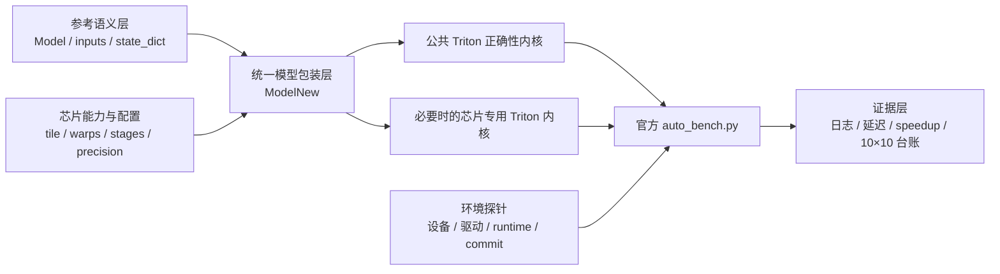

# KernelSwift Triton 全芯片适配技术设计

文档状态：评审稿  
版本：0.1  
配套计划：[`适配计划书.md`](./适配计划书.md)

## 编制依据与边界

本设计只从 [`赛道说明.md`](./赛道说明.md) 给出的 10 份 PyTorch reference、10 款指定芯片、
评分规则、代码要求和提交要求推导。赛道说明链接的官方评测器用于确定评测接口；KernelSwift
手册用于确定平台工作流。

本文是绿地技术设计，文中的代码结构均为拟议结构，不代表当前目录状态。

## 1. 设计目标

本设计为 10 个算子在 10 款芯片上的实现、调优和证据管理定义统一结构。设计优先级为：

1. 参考语义完全一致；
2. 所有目标芯片可编译、可运行；
3. 结果可复现、可审计；
4. 在不破坏前三项的基础上追求性能。

## 2. 约束

- `ModelNew.__init__` 和 `forward` 参数及默认值必须与参考 `Model` 一致。
- 参数和 buffer 名称、shape 必须允许官方评测器加载参考状态字典。
- 正式执行路径必须运行自定义 Triton 内核；不设计 PyTorch 计算回退路径。
- 默认正确性容差为 `atol=1e-2, rtol=1e-2`；整数结果要求完全相等。
- 正式性能口径为 warmup 200、repeat 500、中位延迟。
- 每款芯片使用其实际安装的 PyTorch/Triton 或厂商 fork，不假设所有 fork API 完全一致。
- 随机算子必须保持参考 seed 和随机数消费顺序。

## 3. 总体架构



### 3.1 参考语义层

`reference/` 是功能规范来源。该层不做性能修改，用于：

- 固定接口、参数和输出结构；
- 生成官方输入；
- 提供状态字典；
- 作为正确性和性能 reference。

### 3.2 模型包装层

每题保留独立 `ModelNew`，负责：

- 保存与参考一致的参数和 buffer；
- 从输入 shape、dtype 和已选择的芯片配置计算 grid；
- 分配输出和必要的中间张量；
- 调用公共或专用 Triton 内核；
- 返回完全一致的输出类型与结构。

包装层可以做 shape/view、输出分配和编译期配置选择，但不能用 PyTorch 完成被优化的主体计算。

### 3.3 芯片能力与配置层

芯片配置建议使用显式数据，而非在内核中散落厂商判断。每个配置至少包含：

| 字段 | 含义 |
|---|---|
| `chip_key` | 覆盖台账中的稳定芯片键 |
| `runtime_family` | 实际 PyTorch/设备运行时标识 |
| `supported_dtypes` | fp32、fp16、bf16 等实测支持 |
| `primitive_status` | dot、argmax、reshape、erf、sin/cos 等探针结果 |
| `block_m/n/k` | GEMM 或二维 tile |
| `block_seq/d` | attention tile |
| `num_warps` | 该内核验证过的并行配置 |
| `num_stages` | 验证过的流水配置 |
| `precision_mode` | dot/累加精度策略 |
| `evidence_commit` | 该配置对应的验证 commit |

配置选择发生在 host 侧，并作为 `tl.constexpr` 传入。公共配置是 correctness baseline；只有在
目标芯片日志证明需要时才新增芯片覆盖项。

### 3.4 Triton 内核层

内核分两类：

- 公共正确性内核：只使用目标厂商普遍支持或已由探针验证的 Triton 原语。
- 芯片专用优化内核：与公共内核保持相同语义，只改变分块、调度、融合或数据复用。

专用内核不是 PyTorch fallback。若专用内核失败，应在适配阶段修复；正式代码不得捕获异常后
绕回参考实现。

### 3.5 评测与证据层

每次设备运行产生：

- 环境快照；
- 每题完整 stdout/stderr；
- 可机读 summary；
- 10×10 台账更新草稿；
- 与代码 commit 的关联。

只有评测进程成功且能解析出官方 PASS、reference 延迟、optimized 延迟和 speedup，才能把
单元状态改为 `passed`。平台排队、运行中、基础设施失败和内核失败必须使用不同状态。

## 4. 建议的仓库结构

以下结构是从赛道交付要求推导的实施目标，本轮不创建：

```text
reference/                     10 份冻结参考实现
triton_kernels/
  common/                      公共内核与工具
  profiles/                    芯片和算子配置
  01_grouped_topk.py
  ...
  10_head_compute_mix_bwd.py
tests/
  static/                      接口、编码、禁用 fallback 检查
  numeric/                     无设备公式与索引检查
  device/                      冒烟、增强正确性和性能入口
tools/
  probe_environment.py
  run_all.py
  validate_coverage.py
results/
  coverage.json                10×10 权威台账
  <chip>/<commit>/<timestamp>/ 环境、日志和摘要
```

若官方提交要求每题单文件，构建步骤应把公共内核内联成独立提交文件；仓库源码仍保留模块化结构，
并验证“模块化源文件”和“打包单文件”AST 接口一致。

## 5. 接口与数据契约

### 5.1 模型契约

- `ModelNew` 必须与对应 `Model` 具有相同构造参数名、顺序和默认值。
- `forward` 参数名、顺序和默认值相同。
- 含参数的 02、04 任务必须使 `load_state_dict()` 严格成功；实施阶段不接受官方评测器静默
  忽略加载异常作为“兼容”。
- 含 buffer 的 05 任务必须保持 buffer 名称、shape、dtype 和持久化属性一致。
- list/tuple 输出的容器类型和元素顺序不得改变。

赛道说明要求提交模型接口与 reference 一致；其链接的官方评测器把优化类命名为
`ModelNew`。因此设计采用 `ModelNew` 类名，同时逐项保持 reference `Model` 的构造和
`forward` 契约。

### 5.2 dtype 契约

| 计算 | 建议内部精度 | 输出精度 |
|---|---|---|
| softmax、路由权重、归约 | fp32 | 参考指定 dtype |
| fp16/bf16 GEMM | 后端验证的乘法精度，优先 fp32 累加 | 参考 dtype |
| LayerNorm 均值与方差 | fp32 | 输入/参考 dtype |
| Sinkhorn | fp32 | fp32 |
| attention softmax | fp32 | query dtype |
| 手写反向归约 | fp32 | 对应参考梯度 dtype |

对 `tl.dot` 的默认 TF32/IEEE 行为不能跨后端假设一致，必须由 04 任务的分阶段误差和设备探针决定。

### 5.3 shape 契约

竞赛固定输入是首要评分范围，但设计不应无意把合法接口缩窄。固定 shape 可用于编译期专门化；
若某条路径只支持竞赛固定 shape，需在设计和提交说明中明确，不能以 PyTorch 回退处理其他 shape。

## 6. 逐算子设计

### 6.1 GroupedTopk

数据流：每 token 读取全部 expert logits → softmax/sigmoid → 按组求最大值 → 选择 top groups →
在可选 expert 集合中选 top-k → 可选归一化和缩放。

基线设计为一 program 处理一个 token，fp32 完成概率和归约。必须验证：

- `softmax` 与 `sigmoid` 两条构造参数路径；
- group 和 expert tie 的 index 顺序；
- `renormalize`、`routed_scaling_factor`；
- 输出权重 fp32、id int32。

优化点：向量宽度、归约分解、重复 argmax 的成本和读写中间权重的消除。

### 6.2 FusedMoE

逻辑阶段：路由 → token/expert 调度 → gate/up projection → SiLU×up → down projection → top-k 加权归约。

correctness baseline 可以分阶段，性能版本应评估：

- 按 token×rank 直接计算与按 expert 分组计算的分界；
- w1 gate/up 融合加载；
- w2 与路由权重 epilogue 融合；
- 中间 activation/contribution 是否需要落显存；
- fp16 舍入顺序是否与 reference 容差兼容。

不采用“某 expert 没有 token 时回退 PyTorch”的路径。空 expert 只影响 Triton 调度。

### 6.3 FlexAttention

语义为 `[S,H,D]` 的 causal SDPA，固定输入 S=83、H=8、D=64。建议从 tiled online softmax 设计：

- program tile 覆盖若干 query 行和一个 head；
- K/V 按块遍历；
- causal mask 在 score 写入前应用；
- 使用 fp32 running max、normalizer 和 accumulator；
- 最后转换为 query dtype 并 reshape。

首版实现可采用“一 query program 读取完整 K/V”作为低复杂度正确性方案；性能阶段应根据各
后端的编译资源和延迟，升级为 query/KV 分块与 online softmax。

### 6.4 SPLADESparsePooler

逻辑阶段：dense → exact GELU → LayerNorm → decoder → `log1p(relu)` → 按 seq_lens max/sum pool。

设计要求：

- 参数名和 shape 与两个 `nn.Linear`、`LayerNorm` 完全一致；
- GELU 使用参考默认精确形式；
- LayerNorm 使用 fp32 均值/方差；
- decoder 的大词表维度分块，激活 epilogue 尽量融合；
- pooling 支持 max 和 sum，offset 由 `seq_lens` 精确计算。

性能设计分为 GEMM 配置层和后处理融合层。该任务必须保存分阶段诊断能力，因为最终误差可能由
fp32 dot 精度、GELU、LayerNorm 或 decoder 逐级放大。

### 6.5 MusicFlamingoRotaryEmbedding

一个扁平 elementwise 内核根据 batch、position 和 channel 计算 batch/time frequency、phase、cos
和 sin。避免物化广播后的 frequency 张量。

验证重点：batch frequency 的 `repeat_interleave(2)` 索引、time frequency 截断、负角度、输出
shape/dtype 和各后端三角函数误差。

### 6.6 MMEncoderAttention

语义为非因果 SDPA，固定输入 `[B,S,H*D]`，B=2、S=83、H=8、D=64。复用 attention 核心，
但把 causal 作为编译期配置关闭。

设计保留 q_len、kv_len、num_heads、num_kv_heads 的接口语义；竞赛固定用例相等，但不把不相等
情况静默算错。若只实现固定形状，应显式在适配说明中限定而不是回退 PyTorch。

### 6.7 mhc_post

计算：`x * post_layer_mix + einsum(comb_res_mix, residual)`，输出 bf16。

基线可以一 program 覆盖连续 hidden 元素并展开 mhc_mult=4；优化时评估按 token×out_mix×hidden
tile，复用 comb 系数和 residual。fp32 计算后转换 bf16，重点验证 einsum 的输入/输出 mix 轴。

### 6.8 hc_split_sinkhorn

每个 batch×sequence 行独立：切分 pre/post/comb，应用缩放和 base，执行 sigmoid 与 20 次
Sinkhorn 行列归一化。

HC=4 时单 program 小矩阵设计合理。必须保持 reference 第一次行归一化后 `+eps` 的运算顺序，
后续分母 `+eps` 不能合并或重排。

### 6.9 CentreRandomAugmentation

阶段：masked center → expand samples → 随机四元数 → rotation matrix → 旋转 → translation → mask。

设计决定：

- 随机数必须与 reference 的三次 `rand` 和一次 `randn` 消费顺序一致；
- 主体几何计算由 Triton 完成；框架 RNG 只负责生成随机输入，不作为主体计算回退；
- `centre_only=True` 在输出 mask 乘法前返回；
- 稀疏 mask、无 mask 和全 mask 分别测试。

若某厂商 RNG 与 reference 无法逐值一致，先确认官方评测器 seed/设备行为，再决定是否需要实现该
运行时的确定性 RNG 映射，不能降低精度门禁。

### 6.10 head_compute_mix_bwd

对每个 mix 通道计算 sigmoid backward，同时生成：

- elementwise `grad_input_mix`；
- 对前两维归约的 `grad_mhc_base`；
- 对所有元素归约的 `grad_mhc_scale`。

基线按 mix 通道做 fp32 归约，再用第二个小内核汇总 scale partial。优化时比较分块归约与原子
累加，但正式选择必须由各芯片确定性和延迟决定。

## 7. 可移植性设计

### 7.1 原语探针

接入每款芯片时先独立验证：

- masked load/store、broadcast、reduce；
- `tl.dot` 对 fp16、bf16、fp32 的编译和误差；
- `tl.argmax`、`tl.reshape`；
- `tl.erf`、`tl.sigmoid`、`tl.sin`、`tl.cos`；
- program grid 维度、允许的 `num_warps`/`num_stages`；
- 最大静态 tile 和归约宽度。

探针只决定能力配置，不计入算子完成状态。

### 7.2 配置选择

优先顺序：

1. 全芯片公共配置；
2. 同 runtime family 配置；
3. 单芯片配置；
4. 单芯片专用内核。

任何更窄配置都必须有编译或性能日志支撑。禁止仅根据厂商名称猜测架构参数。

### 7.3 编译缓存和 autotune

正式计时前完成编译，不把首次 JIT 成本计入延迟。跨厂商初期不依赖运行时 `triton.autotune`，
先离线选择已验证配置，避免某些 fork 不支持或把搜索成本带入平台任务。后续若采用 autotune，
需固定待评估配置集合、cache key 和结果来源。

## 8. 测试设计

### 8.1 离线层

- UTF-8 和 Python AST/字节码检查；
- `Model`/`ModelNew` 参数和默认值检查；
- state_dict key/shape 设计检查；
- 禁止异常捕获式 fallback 和主体 PyTorch 计算路径；
- NumPy 索引、轴和公式模拟。

离线层不能设置芯片单元为 `passed`。

### 8.2 设备冒烟层

- 加载 reference 和 candidate；
- 严格加载状态字典；
- 单次 forward；
- 同步设备并捕获完整 traceback；
- 核对输出容器、shape 和 dtype。

### 8.3 正确性层

- 官方 seed=42 和固定输入；
- `torch.allclose(atol=1e-2, rtol=1e-2, equal_nan=True)`；
- 整数张量 `torch.equal`；
- 多 seed 和算子特定边界用例；
- 随机算子逐次重置 seed。

### 8.4 性能层

- 快速：warmup 5、repeat 20，用于配置与实现筛选；
- 正式：warmup 200、repeat 500，用于台账和提交；
- 每次计时前确保 JIT 完成并设备同步；
- 记录 reference、optimized 中位延迟和 speedup；
- 重复正式基准时保留所有批次，报告波动而非只挑最佳一次。

## 9. 证据数据模型

覆盖台账必须完整列出 10 个 chip row 和每行 10 个 task cell。建议单元结构：

```json
{
  "status": "passed",
  "reference_ms": 1.234,
  "optimized_ms": 0.456,
  "speedup": 2.706,
  "git_commit": "<40-char commit>",
  "environment": "results/<chip>/<commit>/<run>/environment.json",
  "log": "results/<chip>/<commit>/<run>/<task>.log",
  "measured_at_utc": "<ISO-8601>"
}
```

允许的非完成状态至少包括：`not_run`、`queued`、`running`、`infrastructure_failed`、
`compile_failed`、`runtime_failed`、`accuracy_failed`。状态必须表达失败阶段，不能只写 `failed`。

## 10. 失败诊断流程

1. 导入失败：检查文件打包、共享模块、厂商包和设备字符串。
2. 前端编译失败：最小化到具体 Triton 原语或 Python AST 构造。
3. 后端编译失败：记录 IR/编译器日志，缩小 tile 或调整并行配置。
4. 资源超限：查看寄存器、shared memory、program tensor shape，改变分块或拆分内核。
5. 运行失败：同步到每个阶段，检查越界、stride、dtype 和设备指针。
6. 精度失败：保存 max/mean diff，按中间阶段二分定位。
7. 性能不佳：区分 JIT、launch、memory、compute、同步和 Python/RNG 开销。
8. 基础设施失败：单独记录并重试，不修改算子代码来迎合超时或服务故障。

## 11. 反作弊与安全边界

- 不使用 `try/except` 捕获内核失败后执行 reference。
- 不根据输入值识别固定评测样本并返回预计算结果。
- 芯片分支只选择自定义 Triton 内核和配置。
- 调试中间输出、同步和断言在正式计时代码中移除。
- 平台任务创建、批量提交或其他外部写操作在执行前单独确认范围。

## 12. 设计评审问题

实施前建议明确：

1. 最终提交接受模块化多文件，还是必须为每题生成独立单文件。
2. 固定竞赛 shape 专门化是否可接受，还是要求完整支持构造参数允许的全部 shape。
3. 是否允许 host 侧根据 runtime/chip key 选择配置和专用 Triton 内核。
4. 昆仑芯 P800、壁仞 BR106M 独立资源的 runtime、Triton fork 版本和容器基线。
5. `CentreRandomAugmentation` 使用框架 RNG + Triton 几何主体是否符合最终审核口径。
6. 正确性全覆盖与单芯片榜单冲刺的资源比例。

这些问题确认后，再把本设计拆成实现任务和验收清单。

## 13. Reference 到设计的追踪

| 题号 | Reference 主语义 | 设计章节 | 必须一致的可观察结果 |
|---:|---|---|---|
| 01 | 分组路由 top-k | 6.1 | 权重、expert id、dtype |
| 02 | top-k Fused MoE | 6.2 | state_dict、最终 hidden states |
| 03 | causal SDPA | 6.3 | causal attention 输出 |
| 04 | MLM head + SPLADE pool | 6.4 | list 长度、每段 vocab 向量 |
| 05 | batch/time rotary frequencies | 6.5 | cos/sin tuple、shape、dtype |
| 06 | non-causal SDPA | 6.6 | batch attention 输出 |
| 07 | MHC residual mixing | 6.7 | bf16 mixed residual |
| 08 | split + Sinkhorn | 6.8 | pre/post/comb tuple |
| 09 | centred random rigid augmentation | 6.9 | seed、mask、sample 输出 |
| 10 | manual sigmoid backward | 6.10 | input/scale/base 三个梯度 |

本追踪表只来自赛道说明中的 reference；实现阶段的任何优化都不得改变这些可观察结果。
