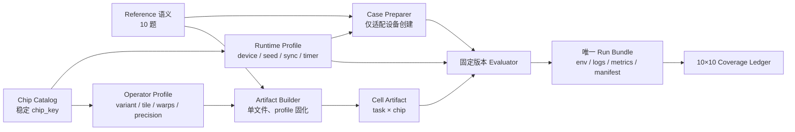

# KernelSwift Triton 全芯片适配技术设计

- 文档状态：重大修改后复审稿（M0 尚未通过）
- 版本：0.2
- 配套计划：[`适配计划书.md`](./适配计划书.md)

## 编制依据与边界

本设计只从 [`赛道说明.md`](./赛道说明.md) 给出的 10 份 PyTorch reference、10 款指定芯片、
评分规则、代码要求和提交要求推导。赛道说明链接的官方评测器用于确定评测接口；KernelSwift
手册用于确定平台工作流。

赛道说明定义目标语义；本设计同时描述当前仓库（as-is）、目标架构（to-be）、差距和迁移步骤。
现有实现不限制目标方案，但所有迁移都必须从当前可验证状态出发。

## 1. 设计目标

本设计为 10 个算子在 10 款芯片上的实现、调优和证据管理定义统一结构。设计优先级为：

1. 参考语义完全一致；
2. 所有目标芯片可编译、可运行；
3. 结果可复现、可审计；
4. 在不破坏前三项的基础上追求性能。

## 2. 约束

- `ModelNew.__init__` 和 `forward` 参数及默认值必须与参考 `Model` 一致。
- 参数和 buffer 名称、shape 必须允许官方评测器加载参考状态字典。
- 正式执行路径必须运行自定义 Triton 内核；不设计 PyTorch 计算回退路径。
- 默认正确性容差为 `atol=1e-2, rtol=1e-2`；整数结果要求完全相等。
- 正式性能口径为 warmup 200、repeat 500、中位延迟。
- 每款芯片使用其实际安装的 PyTorch/Triton 或厂商 fork，不假设所有 fork API 完全一致。
- 随机算子必须保持参考 seed 和随机数消费顺序。

## 3. 现状、差距与目标架构

### 3.1 当前架构（as-is）

| 组件 | 当前实现 | 结论 |
|---|---|---|
| Reference | `reference/` 中 10 题 | 可作为语义来源 |
| Triton 源码 | `triton_kernels/` 中 10 题和 `common.py` | 公共原型，不是厂商适配产物 |
| 芯片选择 | `run_all.py --chip` 自由字符串 | 只改变目录名，不选择 runtime/profile/内核 |
| 配置 | tile、`num_warps` 等写在 Python 源码 | 无芯片 profile 和来源证据 |
| Runtime | 无适配层 | 设备创建、seed、同步和计时未跨厂商闭环 |
| 打包 | 03/04/06 运行时导入 `common.py` | 没有单文件 artifact 或回归 |
| 结果 | 返回码、同名日志和 summary | 不解析指标、无环境/commit、会覆盖 |
| 台账 | 只有 MetaX 任务 row，状态未统一 | 0/100 官方通过 |

### 3.2 目标数据流（to-be）



最终调度键是 `(task_key, chip_key, source_commit, evaluator_commit)`。`--chip` 必须从稳定枚举中
选择，并真正加载 runtime profile、operator profile 和对应单文件 artifact；不再是目录标签。

### 3.3 Reference 语义层

`reference/` 固定接口、参数、输出、官方输入和状态字典。设备适配只允许改变“张量在哪个设备
创建”，不得改 shape、dtype、seed 消费、数值计算或控制流。适配前后 AST 差异和文件 hash
进入 manifest。

### 3.4 Runtime 适配层

每款芯片必须有 runtime profile，字段至少包括：

| 字段 | 含义 |
|---|---|
| `chip_key` | 10 款芯片中的稳定键，不接受自由字符串 |
| `runtime_family` | 厂商 PyTorch/Triton 运行时及版本 |
| `torch_device` | 实际 `torch.device` 类型和 index |
| `accelerator_module` | availability、seed、sync、device info API |
| `source_device_aliases` | reference 中需要审计改写的设备字面量 |
| `seed_strategy` | CPU 和设备 RNG 的设置/恢复顺序 |
| `sync_strategy` | 每次计时前后的同步函数 |
| `timer_strategy` | 官方 wall-clock 或厂商 event 的核准方式 |
| `environment_probe` | 驱动、runtime、编译器、设备属性采集项 |

评测器固定为 DLBlas commit
[`9b5b3627a0f2e5e543ad9d05bf051308bafbd12c`](https://github.com/DeepLink-org/DLBlas/commit/9b5b3627a0f2e5e543ad9d05bf051308bafbd12c)
中的 `benchmarks/ks/auto_bench.py`。该版本会执行 `"npu" → 检测设备`，并在目标为 GCU 时执行
`"cuda" → "gcu"`；它不会在纯 NPU/MLU 环境执行 `"cuda" → "npu"/"mlu"`。

Runtime 适配分两层：

1. Case Preparer 对 reference 和 artifact 的临时副本执行白名单 AST 设备字面量改写，保留原始
   文件、变换 diff 和 hash；不得改写任何计算表达式。
2. Evaluator Adapter 为官方枚举之外的 seed、sync、device info 和计时 API 提供最小透明补丁，
   记录补丁 hash。能使用未修改官方 evaluator 的 runtime 优先使用未修改版本。

若 evaluator 不能识别设备、不能正确同步或不能复现 seed，该 cell 不得进入性能门禁。开发期
补丁是否可作为赛事正式证据必须在提交前向赛事方确认。

### 3.5 芯片与算子 Profile 层

芯片能力 profile 记录 dtype、原语探针和资源上限；算子 profile 固定实际 variant 和编译参数：

| 字段 | 含义 |
|---|---|
| `variant` | portable、tiled、scalar-unrolled、expert-grouped 等实现键 |
| `block_*` | 该算子的 tile 维度 |
| `num_warps/num_stages` | 实测并行和流水参数 |
| `precision_mode` | dot、累加和输出舍入策略 |
| `constraints` | 已验证 shape/dtype，不允许静默缩窄语义 |
| `evidence` | 配置对应的 commit、run id 和设备日志 |

配置不在 `ModelNew.forward` 中按厂商动态猜测。Artifact Builder 在构建某个 cell 时把 profile
固化到单文件；这样平台提交物不依赖 `--chip`、环境变量或运行时 fallback。

### 3.6 模型包装与 Triton 内核层

每题的 canonical `ModelNew` 保存 reference 参数/buffer、分配张量并调用选定 Triton variant。
内核分为 portable correctness、算法优化和必要的厂商专用 variant。专用 variant 仍必须执行
自定义 Triton，不得异常后回退 PyTorch。

### 3.7 Artifact 与评测证据层

每个 `(task, chip)` 构建独立 UTF-8 单文件，内容包含 `ModelNew`、所需 Triton kernel、
`get_init_inputs`、`get_inputs` 和固化 profile，不保留 `from common import ...`。

每次设备运行写入不可覆盖目录：

`results/<chip_key>/<source_commit>/<UTC timestamp>-<run_id>/`

至少包含 `environment.json`、`artifact_manifest.json`、每题 stdout/stderr、`summary.json` 和
evaluator/adapter 标识。只有返回码为零且解析到官方 PASS、reference latency、optimized latency
和 speedup，才能把 cell 标为 `passed`。

## 4. 代码与产物结构及迁移

### 4.1 目标结构

```text
reference/                         10 份冻结 reference
triton_kernels/
  common/                          canonical 公共内核
  variants/<task>/                 算法 variant
profiles/
  chips/<chip_key>.json            runtime 与能力 profile
  operators/<task>/<chip_key>.json 算子编译配置
runtime_adapters/                  设备、seed、sync、timer 适配
tools/
  probe_environment.py
  prepare_case.py
  build_submission.py
  run_all.py
  validate_coverage.py
tests/
  static/ numeric/ device/ artifact/
artifacts/<chip_key>/<task>.py      生成的单文件，不手工编辑
results/<chip>/<commit>/<run>/      不可覆盖证据包
results/coverage.json               10×10 权威台账
environments/<chip_key>/            image digest、包锁和驱动要求
```

### 4.2 单文件构建契约

Builder 解析 canonical task 的本地依赖，按拓扑顺序内联所需 kernel/helper，去重 imports，注入
已校验 profile 常量，并生成 manifest。构建后必须验证：

- 不存在本地模块导入；
- `ModelNew`、输入函数和 state_dict 契约不变；
- profile/chip/task 与命令一致；
- UTF-8、AST 和反 fallback 检查通过；
- 正确性和性能评测使用的就是该 artifact，而非模块化源码。

### 4.3 迁移步骤

1. 固定 evaluator commit、10 个 task key 和 10 个 chip key。
2. 建立 runtime adapter/profile schema 和环境锁文件，不先修改内核。
3. 建立 operator profile，把散落硬编码参数迁入 profile；默认 variant 映射到现有公共原型。
4. 建立单文件 Builder 和 artifact 回归，消除 `common.py` 提交依赖。
5. 重写 runner 和 coverage schema，迁移旧观察状态但不生成任何 `passed`。
6. 按 W1→W4 增加算法 variant；每个 cell 独立通过和提交。
7. 所有历史结果保留，只用新 schema 的有效 run bundle 提升覆盖状态。

## 5. 接口与数据契约

### 5.1 模型契约

- `ModelNew` 必须与对应 `Model` 具有相同构造参数名、顺序和默认值。
- `forward` 参数名、顺序和默认值相同。
- 含参数的 02、04 任务必须使 `load_state_dict()` 严格成功；实施阶段不接受官方评测器静默
  忽略加载异常作为“兼容”。
- 含 buffer 的 05 任务必须保持 buffer 名称、shape、dtype 和持久化属性一致。
- list/tuple 输出的容器类型和元素顺序不得改变。

赛道说明要求提交模型接口与 reference 一致；其链接的官方评测器把优化类命名为
`ModelNew`。因此设计采用 `ModelNew` 类名，同时逐项保持 reference `Model` 的构造和
`forward` 契约。

### 5.2 dtype 契约

| 计算 | 建议内部精度 | 输出精度 |
|---|---|---|
| softmax、路由权重、归约 | fp32 | 参考指定 dtype |
| fp16/bf16 GEMM | 后端验证的乘法精度，优先 fp32 累加 | 参考 dtype |
| LayerNorm 均值与方差 | fp32 | 输入/参考 dtype |
| Sinkhorn | fp32 | fp32 |
| attention softmax | fp32 | query dtype |
| 手写反向归约 | fp32 | 对应参考梯度 dtype |

对 `tl.dot` 的默认 TF32/IEEE 行为不能跨后端假设一致，必须由 04 任务的分阶段误差和设备探针决定。

### 5.3 shape 契约

竞赛固定输入是首要评分范围，但设计不应无意把合法接口缩窄。固定 shape 可用于编译期专门化；
若某条路径只支持竞赛固定 shape，需在设计和提交说明中明确，不能以 PyTorch 回退处理其他 shape。

## 6. 逐算子设计

### 6.1 GroupedTopk

数据流：每 token 读取全部 expert logits → softmax/sigmoid → 按组求最大值 → 选择 top groups →
在可选 expert 集合中选 top-k → 可选归一化和缩放。

至少设计两种 variant：

- `vector_reduce`：一 program 处理一个 token，可使用已通过探针的 reshape/argmax；
- `manual_select`：不使用 `tl.reshape`/`tl.argmax`，用扁平索引、显式 group max 和
  `(score, -index)` 比较实现稳定选择，作为不支持相关原语的 portability path。

两条路径均以 fp32 完成概率和归约，并必须验证：

- `softmax` 与 `sigmoid` 两条构造参数路径；
- group 和 expert tie 的 index 顺序；
- `renormalize`、`routed_scaling_factor`；
- 输出权重 fp32、id int32。

tie 测试必须人工构造相等 logits，确保 group 和 expert id 顺序与 `torch.topk` 在目标 runtime
上的实际行为一致。优化点包括向量宽度、归约分解、重复选择成本和中间写回消除。

### 6.2 FusedMoE

逻辑阶段：路由 → token/expert 调度 → gate/up projection → SiLU×up → down projection → top-k 加权归约。

要求三类 variant，按 profile 选择：

- `token_rank_reference`：分阶段 correctness path，用于最小化语义和精度问题；
- `token_rank_tiled_dot`：gate/up/down 使用二维 tiled `tl.dot`，避免全尺寸 elementwise 归约；
- `expert_grouped`：先按 expert 对 token/rank 分组，再做批量专家 GEMM，减少权重重复读取。

性能版本还应评估：

- 按 token×rank 直接计算与按 expert 分组计算的分界；
- w1 gate/up 融合加载；
- w2 与路由权重 epilogue 融合；
- 中间 activation/contribution 是否需要落显存；
- fp16 舍入顺序是否与 reference 容差兼容。

不采用“某 expert 没有 token 时回退 PyTorch”的路径。空 expert 只影响 Triton 调度。

### 6.3 FlexAttention

语义为 `[S,H,D]` 的 causal SDPA，固定输入 S=83、H=8、D=64。正式 variant 使用 tiled
online-softmax：

- program tile 覆盖若干 query 行和一个 head；
- K/V 按块遍历；
- causal mask 在 score 写入前应用；
- 使用 fp32 running max、normalizer 和 accumulator；
- 最后转换为 query dtype 并 reshape。

现有“一 query program 读取完整 128×64 K/V tensor”的方式仅保留为诊断对照，不作为目标
portable artifact。每款芯片 profile 分别记录 query tile、KV tile、warps、stages 和累加精度。

### 6.4 SPLADESparsePooler

逻辑阶段：dense → exact GELU → LayerNorm → decoder → `log1p(relu)` → 按 seq_lens max/sum pool。

设计要求：

- 参数名和 shape 与两个 `nn.Linear`、`LayerNorm` 完全一致；
- GELU 使用参考默认精确形式；
- LayerNorm 使用 fp32 均值/方差；
- decoder 的大词表维度分块，激活 epilogue 尽量融合；
- pooling 支持 max 和 sum，offset 由任意长度 `seq_lens` 精确计算；prefix 处理不得隐含
  `batch_size <= 8`，token tile 不得隐含单段长度 `<= 32`。长段使用循环或多 program 归约。

性能设计分为 GEMM 配置层和后处理融合层。该任务必须保存分阶段诊断能力，因为最终误差可能由
fp32 dot 精度、GELU、LayerNorm 或 decoder 逐级放大。

离线测试必须增加包含 parameter/state_dict 的完整 PyTorch/NumPy 数值链；仅测试索引或 pooling
不足以提升该题门禁。GEMM profile 分别记录 fp32 dot 的 IEEE/后端模式和误差。

### 6.5 MusicFlamingoRotaryEmbedding

一个扁平 elementwise 内核根据 batch、position 和 channel 计算 batch/time frequency、phase、cos
和 sin。避免物化广播后的 frequency 张量。

验证重点：batch frequency 的 `repeat_interleave(2)` 索引、time frequency 截断、负角度、输出
shape/dtype 和各后端三角函数误差。

该题作为 W1 首轮横向铺量任务；每款芯片保存 `sin/cos` max/mean absolute error、elementwise
block size、warps 和吞吐，不因代码简单而共享芯片结论。

### 6.6 MMEncoderAttention

语义为非因果 SDPA，固定输入 `[B,S,H*D]`，B=2、S=83、H=8、D=64。复用 tiled
online-softmax 核心，但把 causal 作为编译期配置关闭。

设计让 q_len 与 kv_len 独立进入 grid 和 K/V 循环，不因 `q_len != kv_len` 直接拒绝输入；
num_heads/num_kv_heads 的行为必须按 reference 实测确认。固定评分 shape 可专门化配置，但不能把
reference 能处理的长度组合缩窄为异常路径，也不能回退 PyTorch。

### 6.7 mhc_post

计算：`x * post_layer_mix + einsum(comb_res_mix, residual)`，输出 bf16。

基线按 `token × out_mix × hidden_tile` 划分，tile 内复用 comb 系数并遍历 4 个 residual mix，
避免每个标量 program 重复加载。fp32 计算后转换 bf16；每款芯片单独探测 bf16 load/store、
转换误差和最佳 hidden tile，重点验证 einsum 的输入/输出 mix 轴。

### 6.8 hc_split_sinkhorn

每个 batch×sequence 行独立：切分 pre/post/comb，应用缩放和 base，执行 sigmoid 与 20 次
Sinkhorn 行列归一化。

HC=4 时提供两条路径：`matrix_reduce` 使用 reshape/双轴归约；`scalar_hc4` 将 16 个元素标量展开，
手工计算行列和，供不支持相关原语的 fork 使用。必须保持 reference 第一次行归一化后 `+eps`
的运算顺序，后续分母 `+eps` 不能合并或重排。

### 6.9 CentreRandomAugmentation

阶段：masked center → expand samples → 随机四元数 → rotation matrix → 旋转 → translation → mask。

设计决定：

- 随机数必须与 reference 的三次 `rand` 和一次 `randn` 消费顺序一致；
- 主体几何计算由 Triton 完成；框架 RNG 只负责生成随机输入，不作为主体计算回退；
- `centre_only=True` 在输出 mask 乘法前返回；
- 稀疏 mask、无 mask 和全 mask 分别测试。

若某厂商 RNG 与 reference 无法逐值一致，先确认官方评测器 seed/设备行为，再决定是否需要实现该
运行时的确定性 RNG 映射，不能降低精度门禁。每个 runtime profile 必须记录 `manual_seed`、
设备 seed、状态恢复、三次 `rand`、一次 `randn` 的消费验证和三角函数误差；全零 mask 同时覆盖
`centre_only=True/False`。

### 6.10 head_compute_mix_bwd

对每个 mix 通道计算 sigmoid backward，同时生成：

- elementwise `grad_input_mix`；
- 对前两维归约的 `grad_mhc_base`；
- 对所有元素归约的 `grad_mhc_scale`。

正式 portable variant 使用 `rows` 分块产生 fp32 `grad_base/grad_scale` partial，再用固定顺序的
二次归约合并；不使用单 program 归约全部 2048 行作为唯一方案。可比较原子累加 variant，但只有
在目标芯片证明确定性和精度后才能选入 profile。

## 7. 可移植性设计

### 7.1 原语探针

接入每款芯片时先独立验证：

- masked load/store、broadcast、reduce；
- `tl.dot` 对 fp16、bf16、fp32 的编译和误差；
- `tl.argmax`、`tl.reshape`；
- `tl.erf`、`tl.sigmoid`、`tl.sin`、`tl.cos`；
- program grid 维度、允许的 `num_warps`/`num_stages`；
- 最大静态 tile 和归约宽度。

探针只决定能力配置，不计入算子完成状态。

### 7.2 配置选择

优先顺序：

1. 全芯片公共配置；
2. 同 runtime family 配置；
3. 单芯片配置；
4. 单芯片专用内核。

任何更窄配置都必须有编译或性能日志支撑。禁止仅根据厂商名称猜测架构参数。

### 7.3 编译缓存和 autotune

正式计时前完成编译，不把首次 JIT 成本计入延迟。跨厂商初期不依赖运行时 `triton.autotune`，
先离线选择已验证配置，避免某些 fork 不支持或把搜索成本带入平台任务。后续若采用 autotune，
需固定待评估配置集合、cache key 和结果来源。

### 7.4 厂商接入清单

下表只记录当前可证明状态；“待确认”不能被 profile 默认值替代。

| chip_key | 当前状态 | 首个 runtime/profile 门禁 |
|---|---|---|
| `ascend_a2_910b` | `not_run` | 解决 `cuda` reference 输入创建；验证 NPU seed/sync、原语和精度 |
| `metax_c500` | 平台任务有观察状态，无有效 PASS | 获取完整日志；区分基础设施、编译、运行和精度 |
| `iluvatar_bi150` | `not_run` | 确认设备类型、accelerator module、同步和 Triton fork |
| `enflame_s60` | `not_run` | 验证 GCU device rewrite、dot、数学函数和资源上限 |
| `thead_810e` | `not_run` | 确认设备类型、官方 runner 和厂商 fork 能力 |
| `cambricon_mlu590_m9d` | `not_run` | 解决 `cuda` reference 输入创建；验证 MLU seed/sync、bf16 和大归约 |
| `hygon_bw1000` | `not_run` | 确认是否 CUDA 兼容；即使兼容也单独建立 profile 和证据 |
| `moore_threads_ph100` | 资源路径未关闭 | 先确认 KernelSwift/赛事资源和 runtime，再建立 profile |
| `kunlun_p800` | 独立资源、`not_run` | 固定容器、设备适配、厂商 fork 和 evaluator adapter |
| `biren_br106m` | 独立资源、`not_run` | 独立固定环境、profile 和证据，不共享 P800 结论 |

### 7.5 环境可复现设计

根目录的宽松 `torch>=2.1`、`triton>=2.1` 只能作为通用开发提示，不能作为任何芯片的验证环境。
每个 `environments/<chip_key>/manifest.json` 必须锁定：

- 容器 image 与 digest 或基础系统版本；
- Python 精确版本；
- torch、triton、厂商扩展及编译器的精确版本/构建号；
- 驱动、固件、设备型号和可见设备环境变量；
- 安装来源、完整性 hash 和启动命令；
- evaluator commit、adapter patch hash 和环境探针输出。

无法锁定的闭源组件要记录厂商镜像标识和探针输出，不得用无上限 requirements 代替。

## 8. 测试设计

### 8.1 离线层

- UTF-8 和 Python AST/字节码检查；
- `Model`/`ModelNew` 参数和默认值检查；
- state_dict key/shape 设计检查；
- 禁止异常捕获式 fallback 和主体 PyTorch 计算路径；
- NumPy 索引、轴和公式模拟。

离线层不能设置芯片单元为 `passed`。

### 8.2 设备冒烟层

- 通过 `chip_key` 加载 runtime/operator profile，并构建单文件 artifact；
- 对临时 reference 与 artifact 执行仅设备创建相关的 case preparation；
- 加载 prepared reference 和 artifact；
- 严格加载状态字典；
- 单次 forward；
- 同步设备并捕获完整 traceback；
- 核对输出容器、shape 和 dtype。

### 8.3 正确性层

- 官方 seed=42 和固定输入；
- `torch.allclose(atol=1e-2, rtol=1e-2, equal_nan=True)`；
- 整数张量 `torch.equal`；
- 多 seed 和算子特定边界用例；
- 随机算子逐次重置 seed。

### 8.4 性能层

- 快速：warmup 5、repeat 20，用于配置与实现筛选；
- 正式：warmup 200、repeat 500，用于台账和提交；
- 每次计时前确保 JIT 完成并设备同步；
- 记录 reference、optimized 中位延迟和 speedup；
- 重复正式基准时保留所有批次，报告波动而非只挑最佳一次。

### 8.5 Runner 契约

- `--chip` 使用 10 个稳定键的 argparse choices，未知键在运行前失败。
- runner 必须加载 runtime/operator profile、构建或校验对应 artifact；目录名由已加载 profile 得出。
- 每次调用生成唯一 run id 和新目录，绝不覆盖旧日志或 summary。
- 环境探针在执行算子前完成；无法识别设备、seed 或 sync 时 fail closed。
- 成功条件同时要求 evaluator 返回码为零和 stdout 可解析出官方 PASS、v0/v1 latency、speedup。
- summary 记录完整命令、超时、stdout/stderr 路径、commit、artifact/profile hash 和 evaluator adapter。
- coverage 更新前执行 schema 验证；`--no-update-coverage` 支持诊断运行。

## 9. 证据数据模型

覆盖台账必须完整列出 10 个 chip row 和每行 10 个 task cell。建议单元结构：

```json
{
  "status": "passed",
  "task_key": "05_music_flamingo_rotary_embedding",
  "chip_key": "ascend_a2_910b",
  "run_id": "<UTC timestamp>-<random suffix>",
  "reference_ms": 1.234,
  "optimized_ms": 0.456,
  "speedup": 2.706,
  "git_commit": "<40-char commit>",
  "evaluator_commit": "9b5b3627a0f2e5e543ad9d05bf051308bafbd12c",
  "artifact_sha256": "<sha256>",
  "runtime_profile": "profiles/chips/ascend_a2_910b.json",
  "operator_profile": "profiles/operators/05_music_flamingo_rotary_embedding/ascend_a2_910b.json",
  "environment": "results/<chip>/<commit>/<run>/environment.json",
  "log": "results/<chip>/<commit>/<run>/<task>.log",
  "measured_at_utc": "<ISO-8601>"
}
```

任务 cell 状态枚举固定为：`not_run`、`resource_blocked`、`queued_observed`、`running_observed`、
`infrastructure_failed`、`import_failed`、`compile_failed`、`runtime_failed`、`accuracy_failed`、
`benchmark_failed`、`passed`。失败状态必须包含 detail、run id 和日志；禁止
`failed_detail_pending`。芯片资源状态与任务 cell 状态分开存储。

Coverage validator 强制：

- 恰好 10 个 chip row × 10 个 task cell；
- chip/task key 来自稳定枚举；
- `passed` 必须有正数延迟、可重算 speedup、环境、artifact、commit 和存在的日志；
- 台账写入使用临时文件后原子替换；失败不能清除上一个有效 PASS，只追加 run history；
- 旧 MetaX 观察状态迁移为 `*_observed`/`infrastructure_failed`，不产生 PASS。

当前台账的有效完成度保持 **0/100**，直到新 runner 产生满足上述 schema 的证据。

## 10. 失败诊断流程

1. 导入失败：检查文件打包、共享模块、厂商包和设备字符串。
2. 前端编译失败：最小化到具体 Triton 原语或 Python AST 构造。
3. 后端编译失败：记录 IR/编译器日志，缩小 tile 或调整并行配置。
4. 资源超限：查看寄存器、shared memory、program tensor shape，改变分块或拆分内核。
5. 运行失败：同步到每个阶段，检查越界、stride、dtype 和设备指针。
6. 精度失败：保存 max/mean diff，按中间阶段二分定位。
7. 性能不佳：区分 JIT、launch、memory、compute、同步和 Python/RNG 开销。
8. 基础设施失败：单独记录并重试，不修改算子代码来迎合超时或服务故障。

## 11. 反作弊与安全边界

- 不使用 `try/except` 捕获内核失败后执行 reference。
- 不根据输入值识别固定评测样本并返回预计算结果。
- 芯片分支只选择自定义 Triton 内核和配置。
- 调试中间输出、同步和断言在正式计时代码中移除。
- 平台任务创建、批量提交或其他外部写操作在执行前单独确认范围。

## 12. 设计评审问题

实施前建议明确：

1. 固定竞赛 shape 专门化是否可接受，还是要求完整支持构造参数允许的全部 shape。
2. Artifact Builder 生成的独立单文件是否满足最终邮件/PR和 KernelSwift 输入要求。
3. 赛事是否接受对官方 evaluator 的透明 runtime adapter；正式成绩需要哪种官方 runner。
4. 昆仑芯 P800、壁仞 BR106M 独立资源的 runtime、Triton fork 版本和容器基线。
5. `CentreRandomAugmentation` 使用框架 RNG + Triton 几何主体是否符合最终审核口径。
6. PH100 的赛事/KernelSwift 资源路径和预计开放时间。

这些问题确认后，再把本设计拆成实现任务和验收清单。

## 13. Reference 到设计的追踪

| 题号 | Reference 主语义 | 设计章节 | 必须一致的可观察结果 |
|---:|---|---|---|
| 01 | 分组路由 top-k | 6.1 | 权重、expert id、dtype |
| 02 | top-k Fused MoE | 6.2 | state_dict、最终 hidden states |
| 03 | causal SDPA | 6.3 | causal attention 输出 |
| 04 | MLM head + SPLADE pool | 6.4 | list 长度、每段 vocab 向量 |
| 05 | batch/time rotary frequencies | 6.5 | cos/sin tuple、shape、dtype |
| 06 | non-causal SDPA | 6.6 | batch attention 输出 |
| 07 | MHC residual mixing | 6.7 | bf16 mixed residual |
| 08 | split + Sinkhorn | 6.8 | pre/post/comb tuple |
| 09 | centred random rigid augmentation | 6.9 | seed、mask、sample 输出 |
| 10 | manual sigmoid backward | 6.10 | input/scale/base 三个梯度 |

本追踪表只来自赛道说明中的 reference；实现阶段的任何优化都不得改变这些可观察结果。

## 14. 首轮评审问题整改追踪

| 评审问题 | 设计整改 | 实现/证据门禁 |
|---|---|---|
| chip profile 仅在文档 | 3.4、3.5 定义 runtime/operator profile 和 artifact 固化 | `--chip` 实际选择 profile/variant；10 个 profile 可验证 |
| `cuda` 设备重写描述错误 | 3.4 固定 evaluator commit 和白名单 case preparation | NPU/MLU prepared reference diff、seed/sync 冒烟 |
| 证据链不足 | 3.7、8.5、9 定义唯一 run bundle 和严格 PASS 解析 | runner self-test、coverage schema、不可覆盖日志 |
| 模块化源码不是提交产物 | 4.2 定义单文件 Builder 契约 | 10 题 artifact 静态检查；设备评测使用 artifact |
| 全局 100/100 阻塞优化 | 配套计划改为 cell pipeline 与 W1～W4 | 任一 cell 通过后立即正式评测/提交 |
| 文档与仓库状态冲突 | 3.1、4.3 增加 as-is 和迁移步骤 | 迁移清单逐项关闭，不把拟议能力写成已完成 |
| 环境与 PH100 资源不足 | 7.4、7.5 和计划资源门禁 | 每芯片锁文件；PH100 资源决策关闭 |
| 逐算子算法风险 | 6.1～6.10 增加 manual/tiled/scalar/partial variant | 各 variant 的编译、精度和性能日志 |

本稿只完成设计整改。M0 是否通过由复审决定；表中“实现/证据门禁”未完成前，仓库仍不能声称
具备 10 厂商适配能力。
